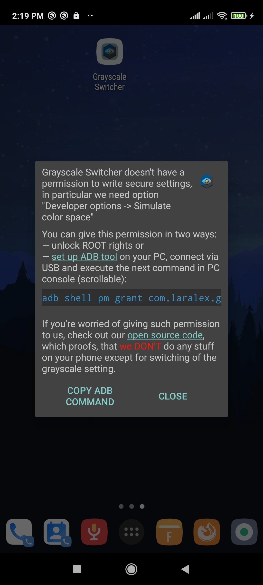

# Grayscale Switcher for Android
Uses Android 5.0+ API to toggle a system setting for monochrome (grayscale) display color. 
I made it, because such application requires either ROOT rights or a permission configured through ADB,
and as I don't quite want to give such permissions to random apps on Google Play, so I made my own - it's free, fast, and nothing malicious (feel free to explore the source code)  

## Source code to look at:
Most of the code in this repository is generated by Android Studio automatically and thus is not so interesting to examine (some manifests, config files, layouts). 

Here's a list of actually important files for this project:
* [`SwitcherActivity.kt`](app/src/main/java/com/laralex/grayswitcher/SwitcherActivity.kt) - the main Activity when you launch the application. 
Entry point is `onCreate` method, where I just check that the application has necessary permissions granted, and if so it tries to switch grayscale mode.
**After that the application is immediately terminated** (no background processes, services, anything).
* [`layout/permission_tip.xml`](app/src/main/res/layout/permission_tip.xml) - the only UI element so far, 
which is displayed to a user when this application is launched with no required permission granted (`WRITE_SECURE_SETTINGS`),
it'll show a little guide on how to fix the issue
* [`values/strings.xml`](app/src/main/res/values/strings.xml) - all the text that can be shown by this application (dunno if anyone is interested in it)

## Install
* download `.apk` and install it on your Android phone
* [set up ADB](https://tasker.joaoapps.com/userguide/en/help/ah_adb_setup.html) for your phone and PC (don't forget to enable Developer options)
* give permission to write secure settings by running in your PC's terminal
```
adb shell pm grant com.laralex.grayswitcher android.permission.WRITE_SECURE_SETTINGS
```
NOTE: you can always revoke this permission by running
```
adb shell pm revoke com.laralex.grayswitcher android.permission.WRITE_SECURE_SETTINGS
```
* run the application

If you still haven't granted the permission, a tooltip dialog will appear (the application won't be able to switch grayscale mode until you resolve the issue).

If the dialog didn't show up - then you should see an **immediate** switch of grayscale mode (without any flickering), 
and also a Toast notification saying that grayscale mode was switched to some new value. 

NOTE: It's technically possible that even with granted permission the mode will not be switched, 
you should see a Toast notification saying that (however I've never encountered such issue on my Xiaomi smartphone).

## Screenshots

